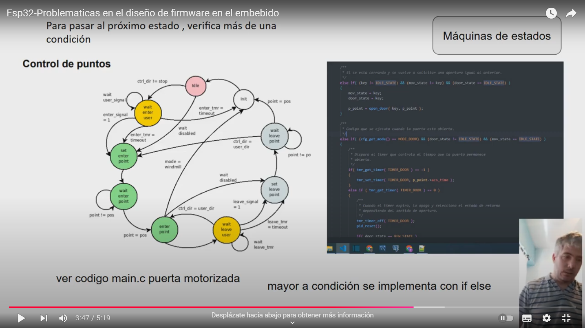
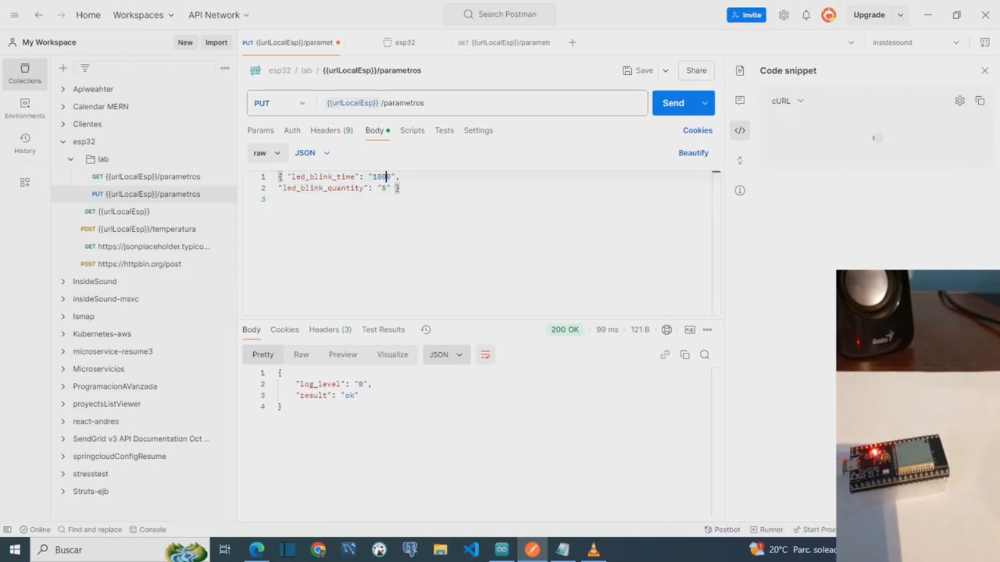
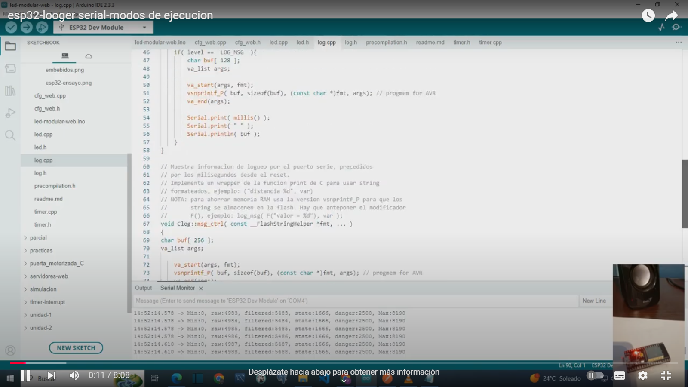
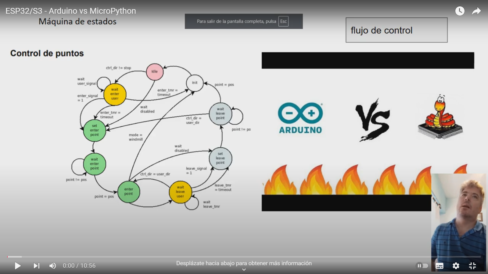

ESP32-S3DEVKITC-1_V1.1: Web-Controlled LED Blink Project

## Project Overview
This project demonstrates a modular architecture for the ESP32-S3DEVKITC-1_V1.13 using Arduino. It supports complex, non-blocking control systems and provides web-based control, data persistence, and serial output in JSON, text, and plotting formats. 

### Key Features:
- **Non-Blocking Methods**: Supports non-blocking timers for managing LEDs and controlling devices like motorized doors. 
- **Web Control**: Hosts a web server on port 8080 to adjust parameters dynamically.
- **Data Persistence**: Ensures configurations remain consistent across reboots.
- **State Machines**: Implements a primary state machine for high-level operations and secondary machines (e.g., PID control for precision tasks).
- **Serial Output Options**: Offers flexible logging in JSON, plain text, and formats compatible with Arduino Plotter.

---

## Project Structure

### File Descriptions:
- `log.h`: Logging utilities.
- `cfg_web.h`: Web configuration management.
- `led.h`: LED control module.
- `precompilation.h`: Precompilation options for flexibility.
- `timer.h`: Non-blocking timer utilities.
- **Main .ino file**: Manages Wi-Fi, web server initialization, and state machine coordination.

---

## Example Setup
The provided code:
1. Establishes a Wi-Fi connection.
2. Sets up a web server for dynamic configuration.
3. Manages LED blinking with adjustable, non-blocking timers.
4. Logs activities to the serial monitor for real-time debugging.

---

API Endpoints
Retrieve Parameters
You can retrieve the device’s configured parameters via the GET endpoint:

Endpoint: GET {{urlLocalEsp}}/config

Example using cURL:
curl --location 'http://192.168.0.53:8080/config'

Modify Parameters and Send Commands
To modify parameters or send commands, use the PUT endpoint:

Endpoint: PUT {{urlLocalEsp}}/config

Example using cURL:
curl --location --request PUT 'http://192.168.0.53:8080/config' \
--header 'Content-Type: application/json' \
--data '{ "log_level": "1" }'

Available Parameters and Commands
General Information
Retrieve all parameters in JSON format:
{ "info": "all-params" }

Log Level
Control the logging verbosity:

Log level 0 (disabled):
{ "log_level": "0" }

Log level 1 (basic messages):
{ "log_level": "1" }

Log level 2 (standard control info):
{ "log_level": "2" }

Log level 3 (Arduino Plotter compatible format):
{ "log_level": "3" }

Control Commands
Start the test with the following command:
{ "cmd": "start" }

Parameter Configuration
LED Blink Time
Set the LED blink time (in milliseconds):
{ "led_blink_time": "1000" }

LED Blink Quantity
Set the number of LED blinks:
{ "led_blink_quantity": "5" }

LED Color
Set the color of LED
{ "led_color": "1" }

    0: Apagado
    1: Rojo
    2: Amarillo
    3: Verde
    4: Blanco
    5: Azul
    6: Cian
    7: Magenta
    8: Naranja
    9: Violeta
    10: Gris

Test Mode
Configure the test mode:

Enable test mode:
{ "st_mode": "1" }

Enable demo mode: JSON MODE
{ "st_mode": "200",  "log_level": "2" }

Enable demo mode: ARDUINO PLOTTER MODE
{ "st_mode": "200",  "log_level": "3" }

--- 

# Usage
Compile and Upload: Use Arduino IDE 2.3.3 to compile and upload the code to your ESP32.
Serial Logging: Adjust log levels dynamically through serial commands.
Author: [educacion.ta@gmail.com]
Date: 07-10-2024

Problems in embedded firmware design

[Presentation](doc/embebidos.pdf)

ESP32-Test execution-Debug via serial port-Data persistence

ESP32 - Execution modes - Logger via serial port

ESP32 - Arduino vs Micropython - 
The main differences in the implementation of non-blocking architecture with a state machine control
 flow between Arduino and Micropython are discussed. And why not the use of IDF.

Repository: https://github.com/theinsideshine/esp32S3-led-micropython